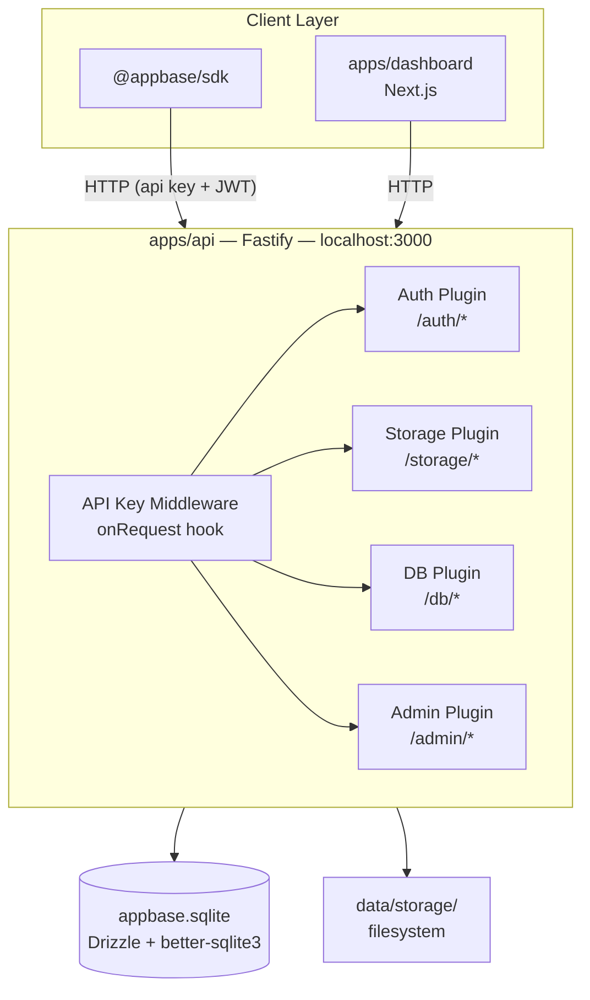
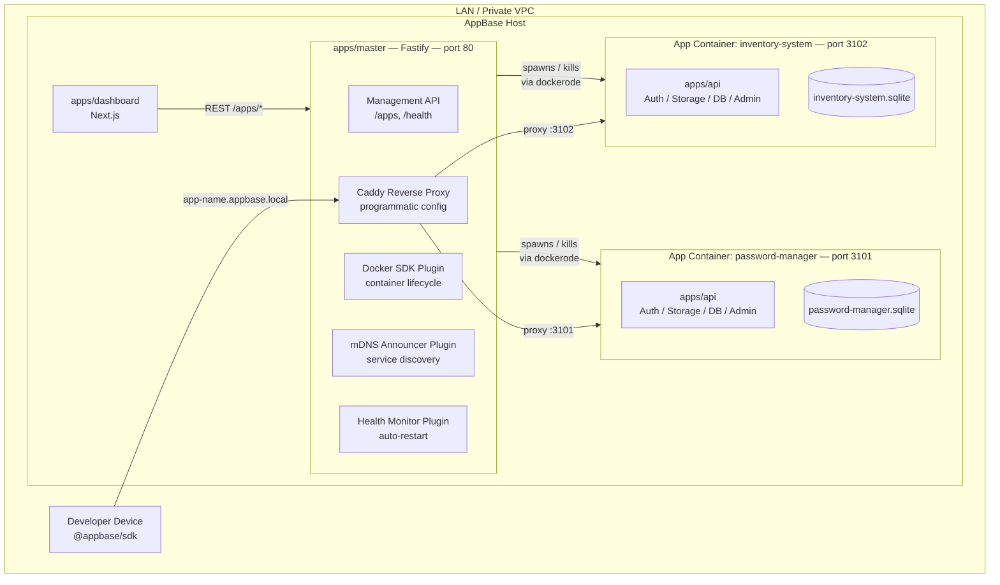
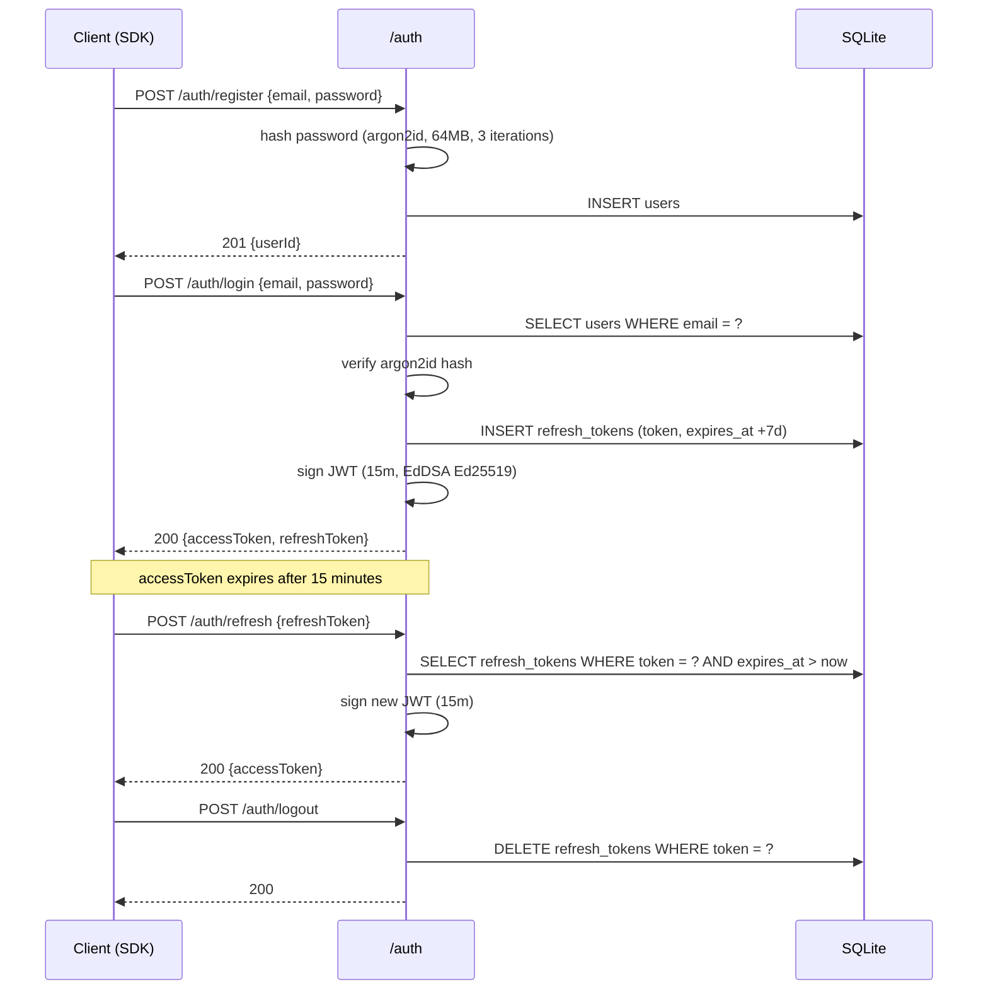
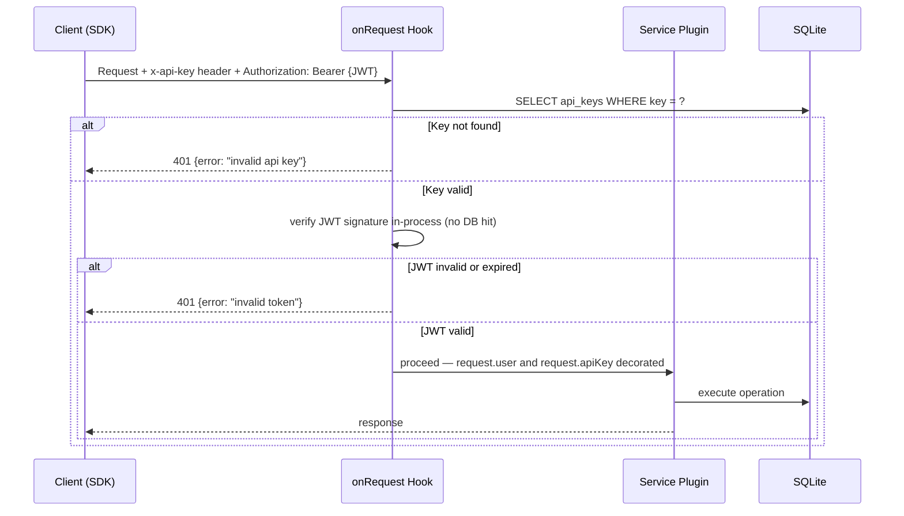
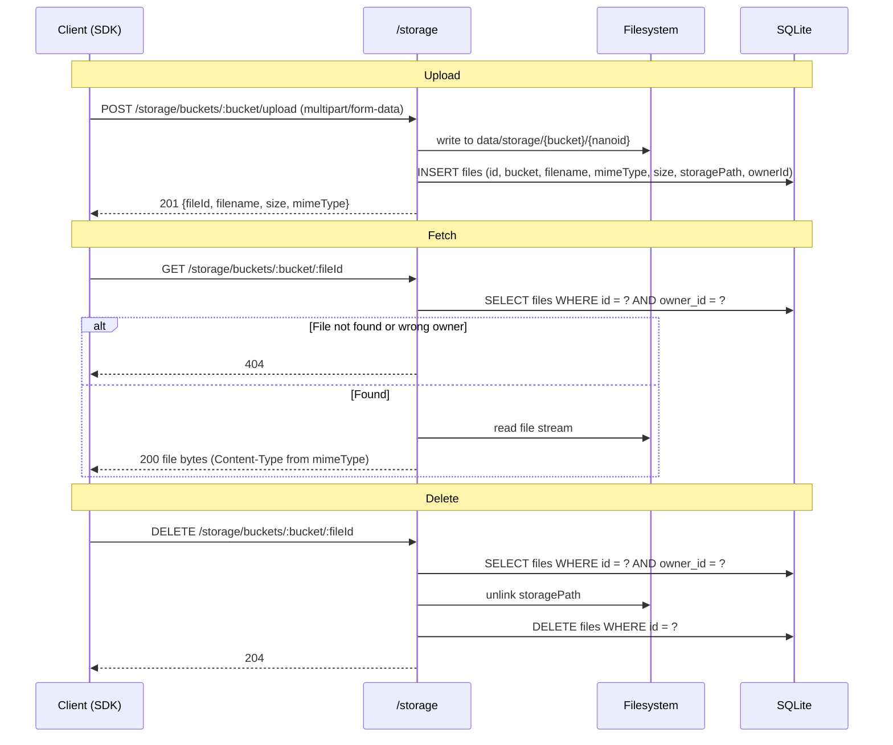
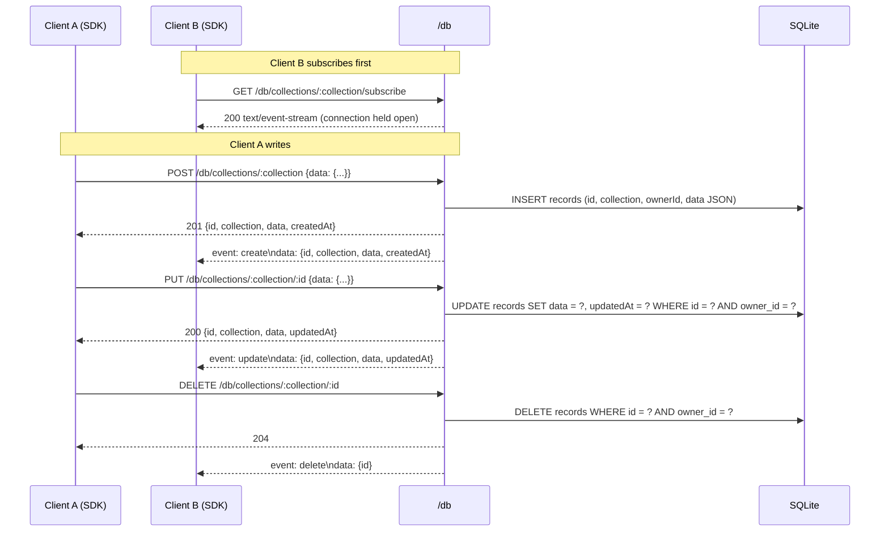

# AppBase — Architecture

> This document is the canonical architecture reference. It covers two views: the **full system vision** (M1–M4) and the **current state** (M1 MVP, single process). Both views are kept here deliberately — the vision is locked, the MVP is what ships first.

---

## Table of Contents

1. [Overview](#1-overview)
2. [Component Diagrams](#2-component-diagrams)
3. [Data Flow Diagrams](#3-data-flow-diagrams)
4. [Database Schema](#4-database-schema)
5. [API Surface Specification](#5-api-surface-specification)
6. [Port Allocation Strategy](#6-port-allocation-strategy)
7. [Data Persistence Directory Structure](#7-data-persistence-directory-structure)
8. [ADR Cross-References](#8-adr-cross-references)

---

## 1. Overview

**Full vision.** AppBase runs on a single host machine on a LAN or private VPC. A master process (`apps/master/`) owns the control plane: it provisions and destroys Docker app containers, manages port assignments, announces services via mDNS, and monitors container health. Each registered app runs as an isolated container — a copy of `apps/api/` — with its own SQLite database, storage namespace, and API key scope. The admin dashboard (`apps/dashboard/`) is a Next.js UI that calls the master API; it is the operator's interface but not the engine. Client applications communicate directly with their app container through the `@appbase/sdk`.

**Current state — M1 MVP.** There are no containers yet. The entire platform runs as a single Fastify process (`apps/api/`) on `localhost:3000`. Auth, Storage, Database, and Admin are four encapsulated plugins within that process. The SDK talks to this process directly. The dashboard calls the same process. The full architecture is what gets built in M2–M4; the MVP exists to prove the BaaS service layer and SDK DX end to end before any infrastructure complexity is introduced.

---

## 2. Component Diagrams

### M1 MVP — Single Process



### Full Vision — M2+ — Master + App Containers



**Role of `apps/master/`.** The master process is not just an API server — it runs persistent background services as Fastify plugins with full `onReady`/`onClose` lifecycle hooks:

| Plugin | Responsibility |
|---|---|
| Docker SDK | Container creation, start, stop, destroy via `dockerode` |
| mDNS Announcer | Announces each running container on the LAN via `mdns`/Bonjour |
| Health Monitor | Periodic liveness checks against `/health` on each container; triggers auto-restart on failure |
| Caddy Config | Writes programmatic Caddy config entries when containers are created or destroyed |

The Next.js dashboard is the operator's face. The master process is the engine.

---

## 3. Data Flow Diagrams

### 3.1 Authentication Flow



### 3.2 API Key Validation (Hot Path)

Applied to every route except `POST /auth/register` and `POST /auth/login` via Fastify `onRequest` hook.



### 3.3 Storage Flow



### 3.4 Database CRUD + SSE Real-Time



---

## 4. Database Schema

### M1 — Unified Schema

All tables live in a single file: `data/appbase.sqlite`. Schema is defined in [`packages/db/src/schema/`](../packages/db/src/schema/) using Drizzle ORM and applied programmatically on startup via `drizzle-kit` migrations.

**`users`**

| Column | Type | Constraints |
|---|---|---|
| `id` | TEXT | PRIMARY KEY |
| `email` | TEXT | NOT NULL, UNIQUE |
| `password_hash` | TEXT | NOT NULL (argon2id) |
| `created_at` | INTEGER | NOT NULL (timestamp) |
| `updated_at` | INTEGER | NOT NULL (timestamp) |

**`refresh_tokens`**

| Column | Type | Constraints |
|---|---|---|
| `id` | TEXT | PRIMARY KEY |
| `user_id` | TEXT | NOT NULL, FK → `users.id` CASCADE DELETE |
| `token` | TEXT | NOT NULL, UNIQUE |
| `expires_at` | INTEGER | NOT NULL (timestamp, +7d) |
| `created_at` | INTEGER | NOT NULL (timestamp) |

**`api_keys`**

| Column | Type | Constraints |
|---|---|---|
| `id` | TEXT | PRIMARY KEY |
| `key` | TEXT | NOT NULL, UNIQUE (`hs_live_*` prefix) |
| `name` | TEXT | NOT NULL |
| `app_id` | TEXT | NOT NULL |
| `created_at` | INTEGER | NOT NULL (timestamp) |

**`files`**

| Column | Type | Constraints |
|---|---|---|
| `id` | TEXT | PRIMARY KEY |
| `bucket` | TEXT | NOT NULL |
| `filename` | TEXT | NOT NULL (original name) |
| `mime_type` | TEXT | NOT NULL |
| `size` | INTEGER | NOT NULL (bytes) |
| `storage_path` | TEXT | NOT NULL (filesystem path) |
| `owner_id` | TEXT | NOT NULL, FK → `users.id` CASCADE DELETE |
| `created_at` | INTEGER | NOT NULL (timestamp) |

**`records`**

| Column | Type | Constraints |
|---|---|---|
| `id` | TEXT | PRIMARY KEY |
| `collection` | TEXT | NOT NULL (developer-defined name) |
| `owner_id` | TEXT | NOT NULL, FK → `users.id` CASCADE DELETE |
| `data` | TEXT | NOT NULL (JSON, `Record<string, unknown>`) |
| `created_at` | INTEGER | NOT NULL (timestamp) |
| `updated_at` | INTEGER | NOT NULL (timestamp) |

**`audit_log`**

| Column | Type | Constraints |
|---|---|---|
| `id` | TEXT | PRIMARY KEY |
| `action` | TEXT | NOT NULL (e.g. `user.register`, `file.upload`) |
| `user_id` | TEXT | nullable |
| `resource` | TEXT | NOT NULL (e.g. `files`, `records`) |
| `resource_id` | TEXT | nullable |
| `metadata` | TEXT | nullable (JSON, `Record<string, unknown>`) |
| `created_at` | INTEGER | NOT NULL (timestamp) |

### M2+ — Split Schema

When multi-app isolation is introduced, data splits into two database layers:

**`master.sqlite`** — owned by `apps/master/`, tracks the control plane:

| Table | Key Columns | Purpose |
|---|---|---|
| `registered_apps` | `id`, `name`, `slug`, `status`, `port`, `container_id`, `created_at` | One row per provisioned app |
| `port_assignments` | `port`, `app_id`, `assigned_at` | Port registry for dynamic allocation |

**`data/{appId}.sqlite`** — one file per registered app, contains the same 6 tables above (`users`, `refresh_tokens`, `api_keys`, `files`, `records`, `audit_log`), fully isolated. When an app is deleted via the master API, the container is destroyed and the entire `data/{appId}/` directory is removed.

---

## 5. API Surface Specification

### App Container API — `apps/api/`

The service API — consumed by `@appbase/sdk` and by the admin dashboard. All routes except `/auth/register` and `/auth/login` require a valid `x-api-key` header. Storage and database routes additionally require a valid `Authorization: Bearer {JWT}` for user-scoped operations.

| Method | Path | Auth | Description |
|---|---|---|---|
| POST | `/auth/register` | public | Create user account |
| POST | `/auth/login` | public | Verify credentials, issue JWT + refresh token |
| POST | `/auth/refresh` | refresh token | Rotate JWT (15m window) |
| POST | `/auth/logout` | bearer | Delete refresh token row |
| POST | `/auth/reset-password` | admin | Admin-mediated password reset |
| POST | `/storage/buckets/:bucket/upload` | api key + bearer | Upload file (multipart/form-data) |
| GET | `/storage/buckets/:bucket/:fileId` | api key + bearer | Download file (user-scoped) |
| DELETE | `/storage/buckets/:bucket/:fileId` | api key + bearer | Delete file (user-scoped) |
| GET | `/storage/buckets/:bucket` | api key + bearer | List bucket contents (user-scoped) |
| POST | `/db/collections/:collection` | api key + bearer | Create record |
| GET | `/db/collections/:collection` | api key + bearer | List records (user-scoped, filterable) |
| GET | `/db/collections/:collection/:id` | api key + bearer | Get single record |
| PUT | `/db/collections/:collection/:id` | api key + bearer | Update record |
| DELETE | `/db/collections/:collection/:id` | api key + bearer | Delete record |
| GET | `/db/collections/:collection/subscribe` | api key + bearer | SSE stream — real-time change events |
| GET | `/admin/users` | api key | List all users for the app |
| GET | `/admin/storage/usage` | api key | Storage usage statistics |
| GET | `/admin/audit-log` | api key | Paginated audit log |
| GET | `/health` | public | Liveness check |
| GET | `/docs` | public | Swagger UI (auto-generated from route schemas) |

### Master API — `apps/master/` (M2+)

The control plane API — consumed only by `apps/dashboard/`. Manages app container lifecycle, API key issuance, and cluster health.

| Method | Path | Description |
|---|---|---|
| GET | `/apps` | List all registered apps with status |
| POST | `/apps` | Register new app — provisions container, assigns port, announces via mDNS |
| GET | `/apps/:id` | App detail: config, health, assigned port |
| DELETE | `/apps/:id` | Destroy container, reclaim port, wipe `data/{appId}/` |
| POST | `/apps/:id/keys` | Issue new API key scoped to this app |
| DELETE | `/apps/:id/keys/:keyId` | Revoke API key |
| GET | `/apps/:id/docs` | Proxied Swagger docs for the app container |
| GET | `/health` | Cluster health — status of all running containers |

---

## 6. Port Allocation Strategy

| Phase | Port | Process | Notes |
|---|---|---|---|
| M1 | `3000` | `apps/api/` — single process | Configurable via `PORT` env variable |
| M2+ | `80` | `apps/master/` | Control plane + reverse proxy entry |
| M2+ | `3100–3999` | App containers | Dynamically assigned per registration |

**M2+ allocation algorithm** (runs inside `apps/master/` at container creation time):

1. Query `port_assignments` for all currently assigned ports in range `3100–3999`
2. Find the lowest integer in that range not present in the result set
3. Write a new row to `port_assignments` atomically before spawning the container
4. On container deletion: `DELETE FROM port_assignments WHERE app_id = ?` — port re-enters the free pool immediately

This keeps port state in SQLite (durable, transactional) rather than in-memory, so it survives master process restarts.

---

## 7. Data Persistence Directory Structure

### M1

```
data/
├── appbase.sqlite          # All platform tables (users, tokens, api_keys, files, records, audit_log)
└── storage/
    └── {bucket}/           # Developer-defined bucket name
        └── {fileId}        # nanoid — actual file bytes, no extension
```

### M2+

```
data/
├── master.sqlite           # Control plane tables (registered_apps, port_assignments)
└── {appId}/                # One directory per registered app (appId = nanoid)
    ├── app.sqlite          # Isolated app tables (same 6-table schema as M1)
    └── storage/
        └── {bucket}/
            └── {fileId}
```

When `DELETE /apps/:id` is called on the master API, the container is stopped and removed, then the entire `data/{appId}/` directory is deleted. This is the full data lifecycle — no orphaned files, no orphaned SQLite rows.

---

## 8. ADR Cross-References

Architecture decisions that shaped this document:

| ADR | Decision | Impact on This Document |
|---|---|---|
| [ADR-001 — API Framework Selection](./adr/ADR-001-api-framework-selection.md) | Fastify selected over Express, Hono, Elysia | Plugin-per-service architecture in §2; `onRequest` hook for API key validation in §3.2 |
| [ADR-002 — ORM and Migration Strategy](./adr/ADR-002-orm-and-migration-strategy.md) | Drizzle ORM + `better-sqlite3` + `drizzle-kit` | Schema tables in §4 sourced directly from `packages/db/src/schema/`; `createDb(path)` factory enables per-app SQLite in M2+ |
| [ADR-003 — Auth Implementation](./adr/ADR-003-auth-implementation.md) | 3-token model (refresh token + JWT + API key); argon2id hashing; EdDSA signing | Auth flow in §3.1; `refresh_tokens` and `api_keys` schema in §4; JWT-on-hot-path pattern in §3.2 |
